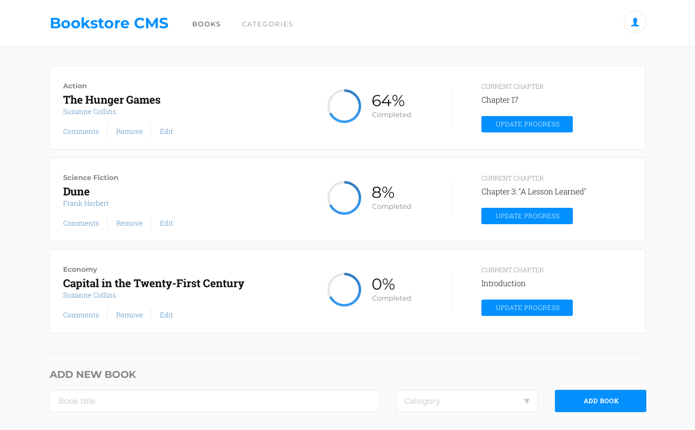

# BOOK STORE

This project is a book store built mainly with React & Redux.

In this project:

- Made a BookList, and BookForm components to show and add books.
- Used Redux to store books' information.
- Made all necessary functions to make in add and remove books.
- Styled the component with css.

<!-- ## Live Demo -->

[LIVE!](https://bookstore-atef.herokuapp.com/)

## Usage

- Clone the repo "https://github.com/Mohamed-js/Book-Store.git"
- npm install
- npm start

## Technologies

- Node.js
- React
- React-DOM
- React-Create-App
- Redux
- npm
- CSS
- ES6

## Author

👤 **Mohammed Atef**

- GitHub: [@Mohamed-Atef](https://github.com/Mohamed-js)
- Twitter: [@Mohammed_Atef](https://twitter.com/Demovejetta)
- LinkedIn: [LinkedIn](https://www.linkedin.com/in/mohamed-js/)

## 🤝 Contributing

Contributions, issues, and feature requests are welcome!

## Show your support

Give a ⭐️ if you like this project!

### Acknowledgements

- Zeplin
- Microverse
